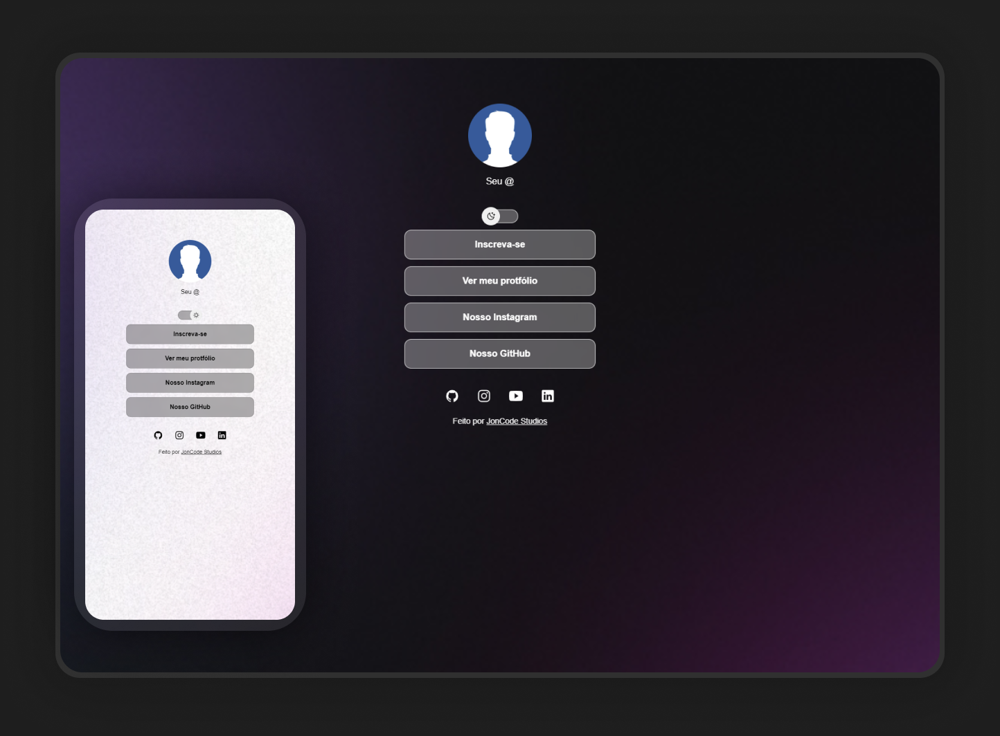

<h1 align="center"> Link Bio </h1>

Programa exclusivo e gratuito, para ser utilizado para link em bio  

  

 

  

## 🚀 Tecnologias

Esse projeto foi desenvolvido com as seguintes tecnologias:

- HTML e CSS
- JavaScript
- Git e Github
- Figma

## 💻 Projeto

O projeto Link Bio é um agregador de links para usar como cartão de visitas online.

- [Acesse o projeto finalizado, online](#)

- [Assistir aulas](#)

## 📝 Licença

Esse projeto está sob a licença MIT.

Feito com ♥ by JonCode Studios